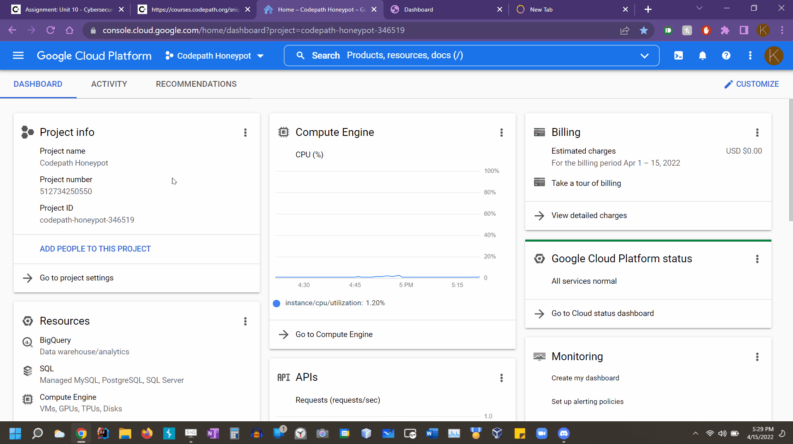

# Cyber Security - Honeypot Project

**Time spent:** **29** hours spent in total

**Objective:** Create a honeynet using MHN-Admin. Present your findings as if you were requested to give a brief report of the current state of Internet security. Assume that your audience is a current employer who is questioning why the company should allocate anymore resources to the IT security team.

### MHN-Admin Deployment

**Summary:** 

I used GCP and deployed it via the Google Cloud SDK shell. However, for the other SHH commands, the GCP client site was used in order to connect to the SHH.
The created admin VM had the following attributes: Ubuntu 18.04 Minimal, HTTP traffic allowed (port 80), opened TCP ports 3000 and 10000 with some firewall rules

### Dionaea Honeypot Deployment 

**Summary:** 

Dionaea is a honeypot that attracts attackers. Then once the honeypot is attacked, it catches (or traps) the payloads and malware of the attacks.

Below displays the honeypot attacks that were recieved thus far since it was created about a week ago. This was documented in the MHN site by visiting the admin VM external IP. It received around 71,000+ attacks from various countries in about 8 days. The most attacked ports documented were ports 23 (6,000+ times), 6379 (200+ times), 21 (200+ times), 80 (100+ times), and 8088 (70+ times).

### Database Backup 

**Summary:** 

It uses the MongoDB RDBMS as seen by the given command in order to access the json file: mongoexport --db mnemosyne --collection session > session.json

The JSON file can be found here!: https://github.com/kgonz038/Week-10-11-Project-Honeypot/blob/main/session.json

Below is a gif of the JSON being created

## Notes

- 1st challenge was using the carrot symbol ^ in place of blackslashes \ when creating the VM via commands. It seems like the carrot symbol cut off or separated commands and caused errors in creations.
- 2nd challenge was not realizing that it was required to document the entire proccess of the VM creations, thus I was only able to document proof of the VMs' existance in the GCP, their SHH connections and the MHN attack report site.
- 3rd challenge was once the honeypot was up and catching attacks, eventually after 3 days, it stopped gathering attacks at all. I had to solve this issue by creating another firewall rule because it seemed that somehow all my ports were NOT opened. After the adding the firewall rule and a sudo reboot of my VM, it was back up and catching more attacks.
- 4th challenge was finding the JSON file. For the first attempt of downloading it to my home directory, the JSON was nowhere to be found. I had to search for it and eventually found a JSON file in appdata -> local -> gcloud folders. But after attmepting it a 2nd time, it appeared in my home user directory like it was supposed to. 
